# Spring Boot Kotlin Backend

### How to run

#### clone the project: https://github.com/gurkanucar/kotlin-spring-boot-example

```bash
  git clone https://github.com/gurkanucar/kotlin-spring-boot-example
  cd kotlin-spring-boot-example
```
#### run tests


```bash
  mvn test
```

#### run app

```bash
  mvn spring-boot:run
```
#### Postman Collection:

[https://github.com/gurkanucar/kotlin-spring-boot-example/blob/master/kotlin-crud-app.postman_collection.json](https://github.com/gurkanucar/kotlin-spring-boot-example/blob/master/kotlin-crud-app.postman_collection.json)

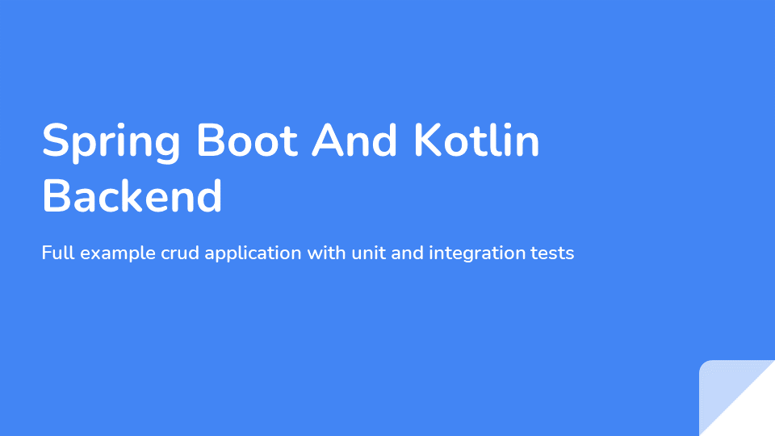

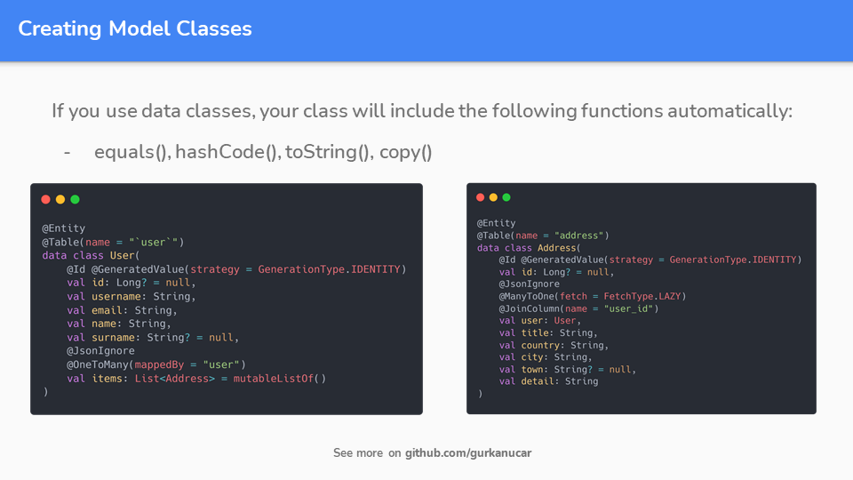
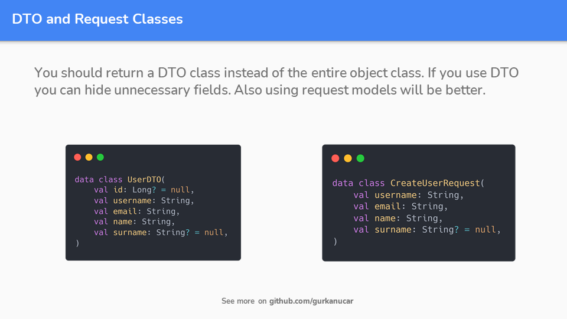
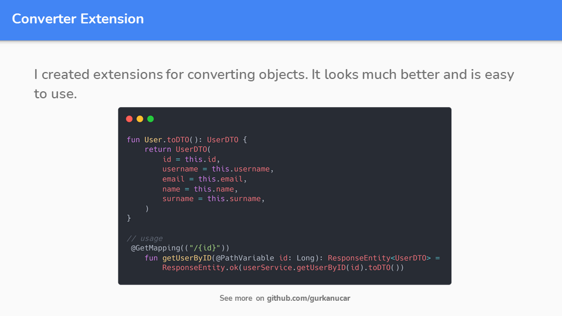
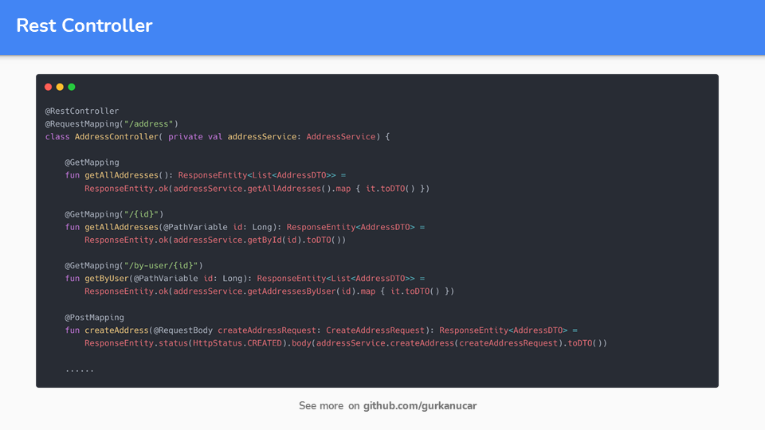
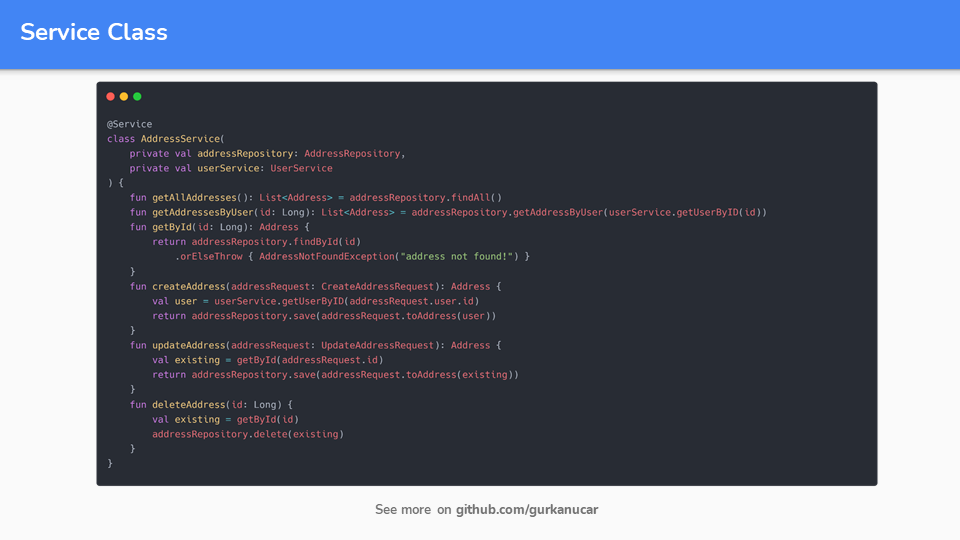
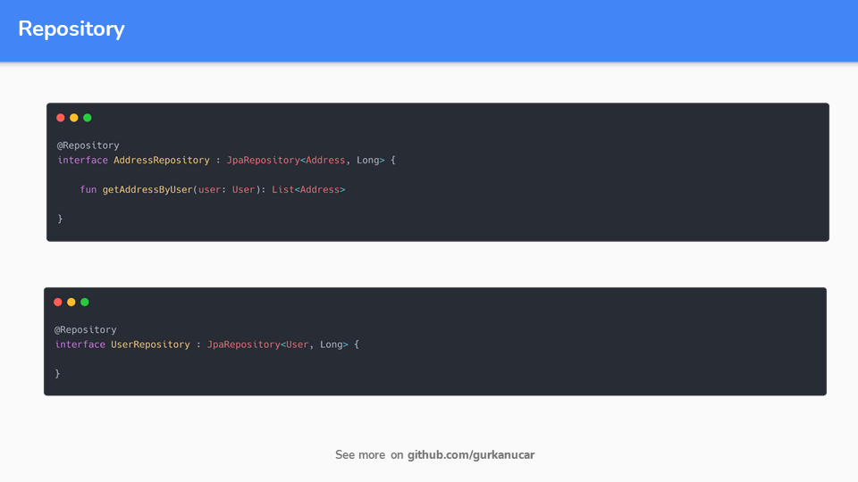
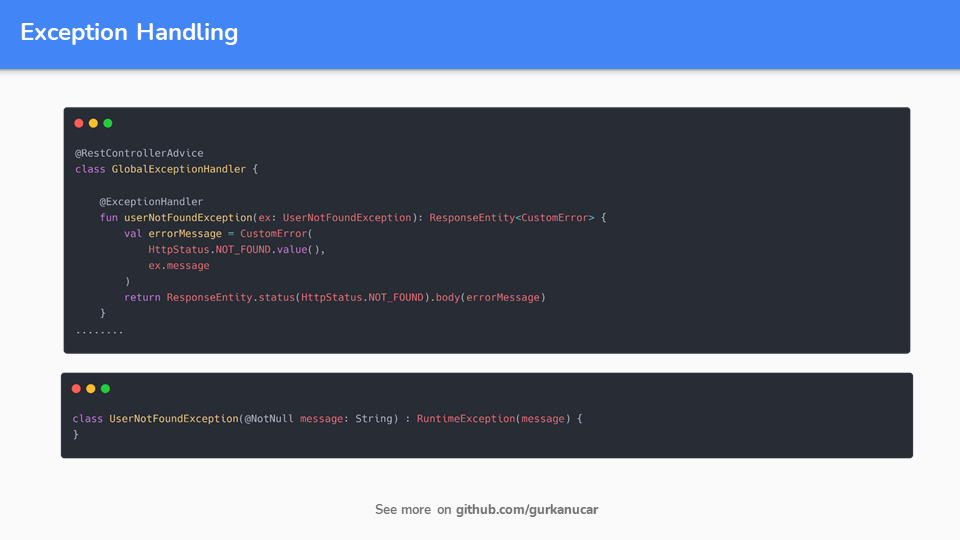
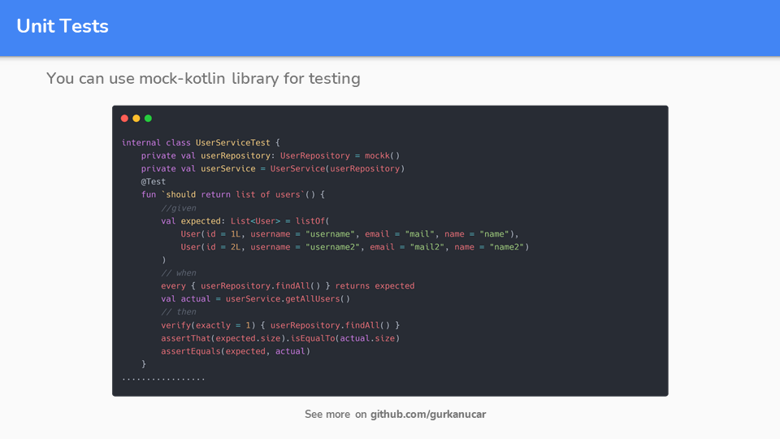
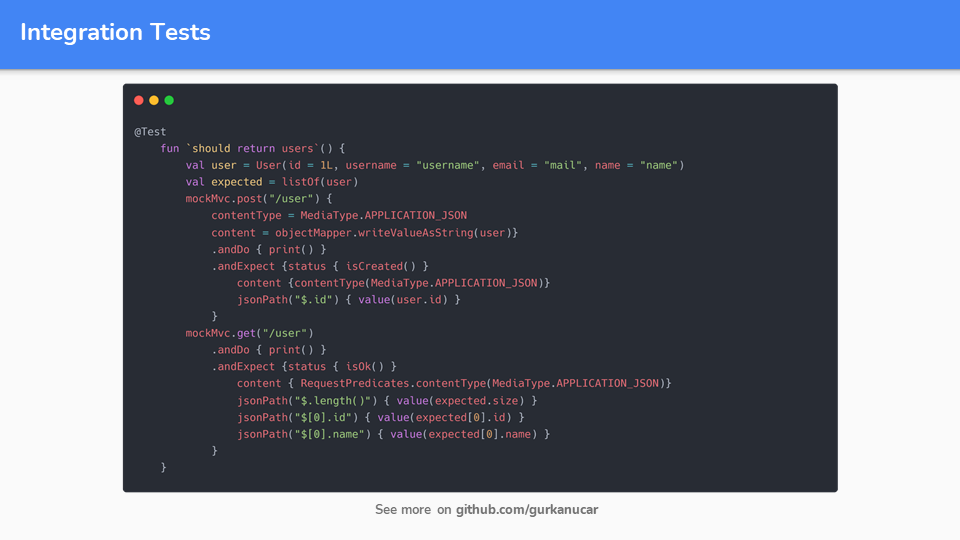
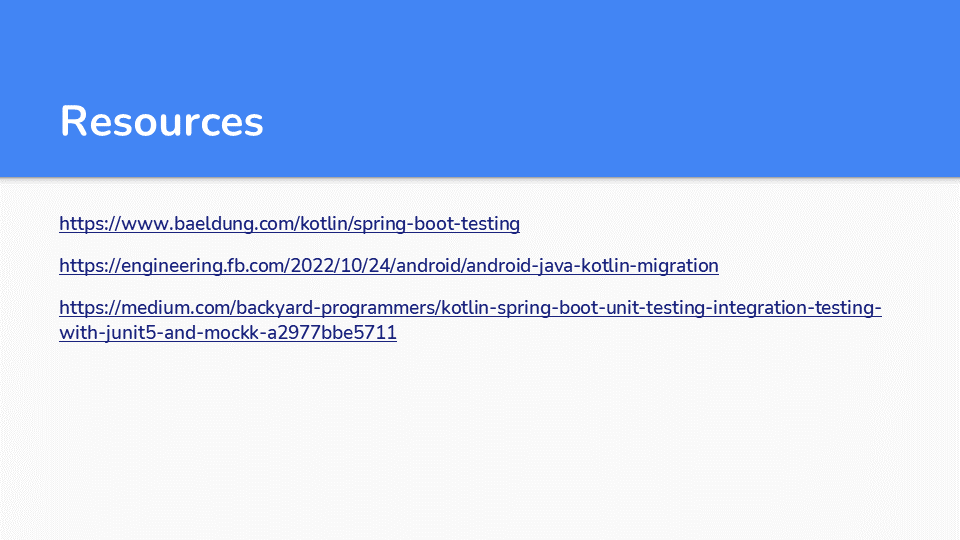

